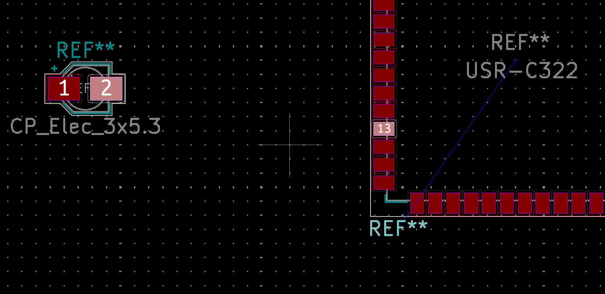
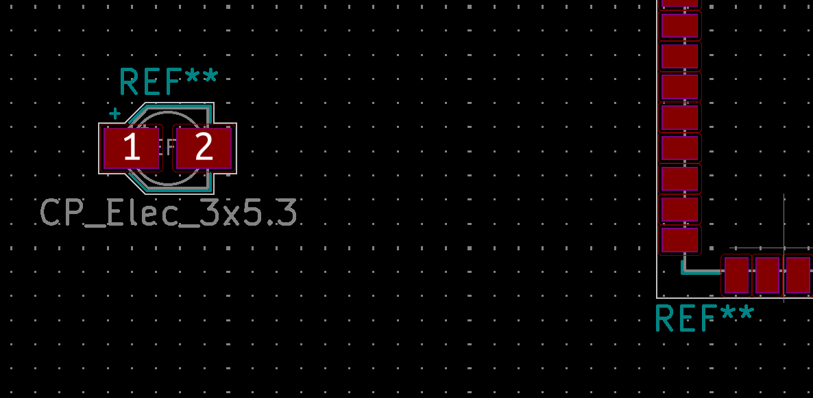

# kicad_align

A KiCAD layout plugin to horizontally or vertically align two pins of two different modules (component).

This may be useful for RF/MW layout or if one is trying to do a clean layout.

Adds two new script commands, Align Horizontal and Align Vertical.

# How to Install

`git clone` this repository into your KiCAD plugins folder (usually `~/.kicad_plugins`).

# Usage

As shown above, select the two pins you want to horizontally or vertically align (example is poised for horizontal alignment) _and the reference designator for the component you **don't** want to move (i.e. serve as the anchor)_

Then, go to `Tools > External Plugins > Align Horizontal` or `Align Vertical` to execute the alignment.

When `Align Horizontal` is selected, the component to be moved moves in the y direction to align the two selected pins.

When `Align Vertical` is selected, the component to be moved moves in the x direction to align the two selected pins.

As shown above, the two selected pins are now perfectly horizontally aligned, and the capacitor component (left) was moved to make it happen.
